<p align="center">
  
</p>

<h1 align="center">NeonPocketMC</h1>

<p align="center"><strong>One bright interface for pocket-sized MeshCore radios.</strong></p>

One release catalog for the NeonPocketMC firmware family. This repository pins the exact released source for every supported RadioCore build and links to each product-owned download.

> **Choose by exact hardware and role. There is no universal image. Never cross-flash D1L, RC52, RCC6, Heltec V3, or Heltec V4 firmware.** Attach a suitable LoRa antenna before transmitting.

## Guided Web Flasher

Open **[flasher.canadaverse.org](https://flasher.canadaverse.org/)** in Chrome or Edge to choose exact hardware, transport, role, screen, WebUI, observer, repeater, or Room Server features. It detects the connected device family, verifies every release checksum, flashes without a whole-chip erase, checks the reboot, and guides supported server onboarding before USB is disconnected.

The Pi-hosted interface proxies immutable binaries from their owning GitHub releases; it does not keep a second firmware archive. Native-USB companion images use the standard binary MeshCore companion protocol and are separate from BLE or Wi-Fi images.

## Demo-scene boot

<p align="center">
  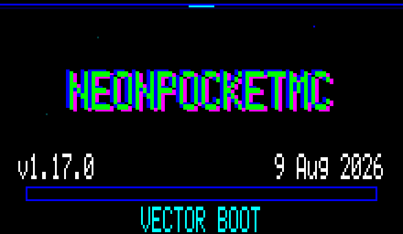
</p>

The TFT builds open with a 3.2-second procedural NeonPocketMC sequence: vector-pocket reveal, mesh nodes, chromatic title glitch, star field, raster beam, specular sweep, staged link status, and a final `MESH READY` lockup. This GIF contains 27 checksum-verified frames captured directly from the RCC6 framebuffer—not a mockup. RC52 companions and TFT Room Servers use the same visual language with role-specific status text.

Capture provenance and checksums are recorded in [`docs/images/demoscene/README.md`](docs/images/demoscene/README.md).

## RCC6 Ultimate companion UI

Ultimate keeps the radio useful without a phone: unread-first Home, complete paged messages, recent-node context, live radio health, device tools, and the one-button composer. These are direct 220×128 framebuffer captures from the connected RCC6 production renderer—not browser mockups.

<table>
  <tr>
    <td align="center"><br><strong>Home</strong></td>
    <td align="center"><br><strong>Inbox</strong></td>
  </tr>
  <tr>
    <td align="center"><br><strong>Network Explorer</strong></td>
    <td align="center">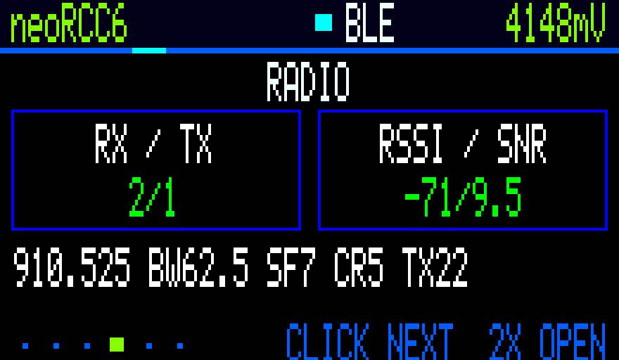<br><strong>Radio analytics</strong></td>
  </tr>
  <tr>
    <td align="center">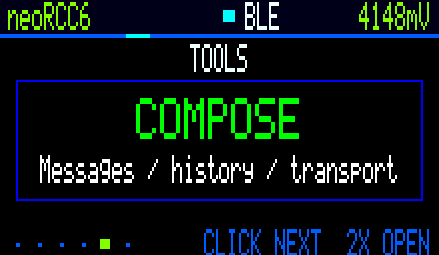<br><strong>Tools</strong></td>
    <td align="center">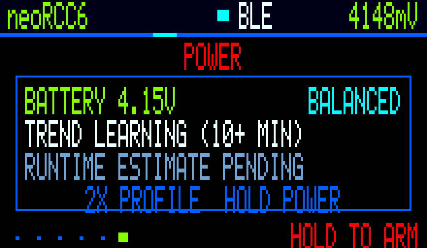<br><strong>Power</strong></td>
  </tr>
  <tr>
    <td align="center">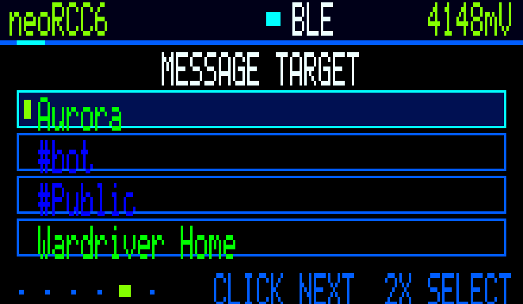<br><strong>Target picker</strong></td>
    <td align="center">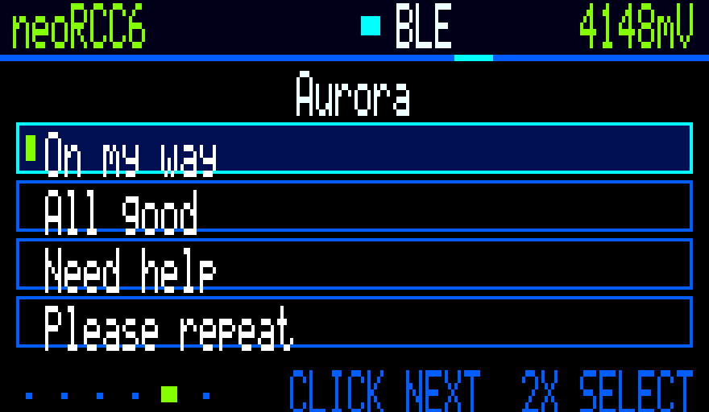<br><strong>Quick composer</strong></td>
  </tr>
</table>

Capture provenance is recorded in [`docs/images/rcc6-ultimate/README.md`](docs/images/rcc6-ultimate/README.md).

## RCC6 classic UI

These are direct, pixel-for-pixel captures of the 220×128 framebuffer running on an RCC6—not mockups. They were captured from a temporary diagnostics build based on the exact [`v1.2.0-rc.1`](https://github.com/n30nex/NeonPocketMC-RCC6/releases/tag/v1.2.0-rc.1) source; the capture hook is not included in public firmware.

<table>
  <tr>
    <td align="center"><br><strong>Home</strong></td>
    <td align="center">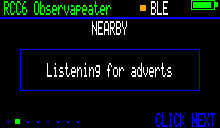<br><strong>Nearby</strong></td>
  </tr>
  <tr>
    <td align="center">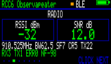<br><strong>Radio statistics</strong></td>
    <td align="center"><br><strong>Mesh advert</strong></td>
  </tr>
  <tr>
    <td align="center">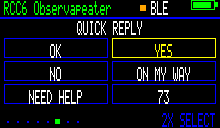<br><strong>One-button Quick Reply</strong></td>
    <td align="center">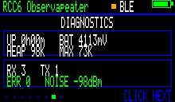<br><strong>Diagnostics</strong></td>
  </tr>
  <tr>
    <td colspan="2" align="center">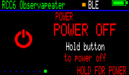<br><strong>Power confirmation</strong></td>
  </tr>
</table>

Capture provenance and checksums are recorded in [`docs/images/rcc6-ui/README.md`](docs/images/rcc6-ui/README.md).

## RCC6 Ultimate service dashboards

The Ultimate Observer and full Room Server share a responsive local dashboard for field status, radio health, MQTT visibility, and recently heard mesh activity. These are real browser captures from the released RCC6 server firmware, not design mockups.

<table>
  <tr>
    <td align="center">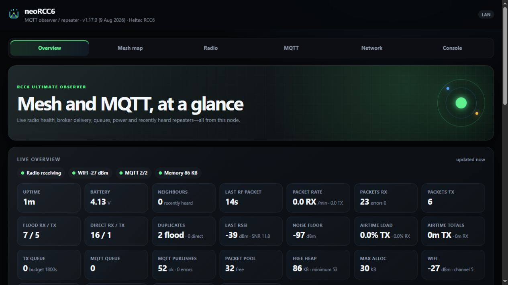<br><strong>Live overview</strong></td>
    <td align="center">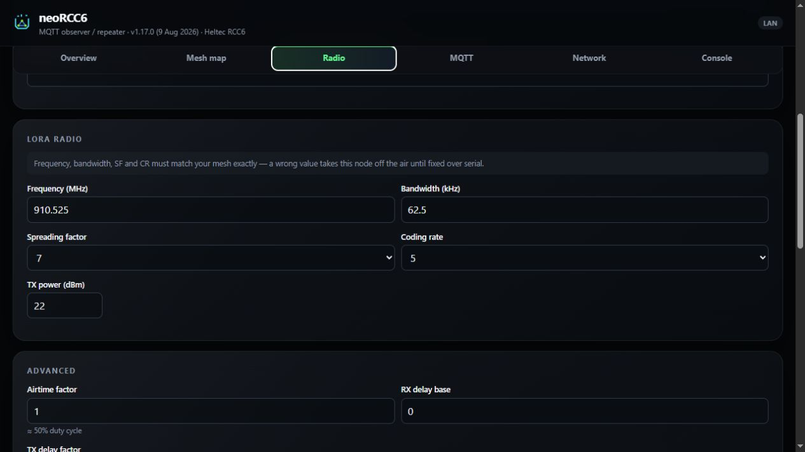<br><strong>Radio metrics</strong></td>
  </tr>
  <tr>
    <td align="center">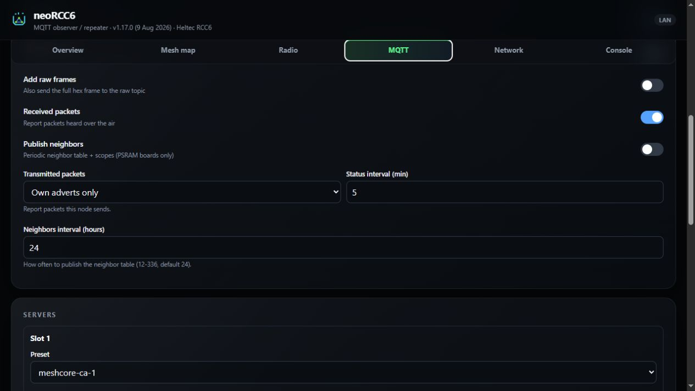<br><strong>MQTT status</strong></td>
    <td align="center">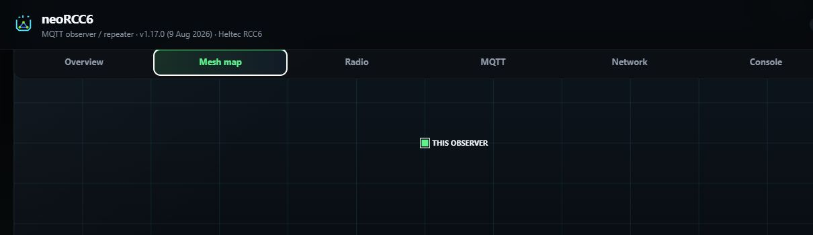<br><strong>Recently heard mesh</strong></td>
  </tr>
</table>

Capture provenance and checksums are recorded in [`docs/images/rcc6-server/README.md`](docs/images/rcc6-server/README.md).

## Live Heltec OLED UI

These frames were captured from the OLED framebuffer running on the physical Heltec V3 qualification unit. The Heltec V4 uses the same compact NeonPocket interaction model with its own board and radio-power implementation.

<p align="center">
  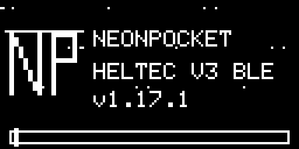
</p>

<table>
  <tr>
    <td align="center"><br><strong>Home</strong></td>
    <td align="center">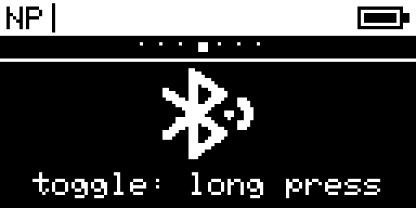<br><strong>Bluetooth</strong></td>
  </tr>
  <tr>
    <td align="center"><br><strong>Advert</strong></td>
    <td align="center"><br><strong>Power</strong></td>
  </tr>
</table>

### Heltec V4/V4.3

<p align="center">
  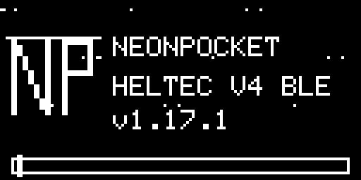
</p>

<table>
  <tr>
    <td align="center">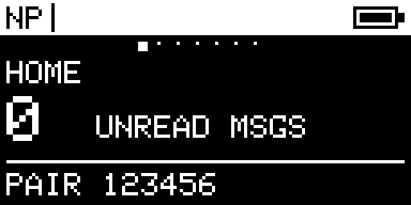<br><strong>Home</strong></td>
    <td align="center"><br><strong>Nearby</strong></td>
  </tr>
  <tr>
    <td align="center"><br><strong>Radio</strong></td>
    <td align="center">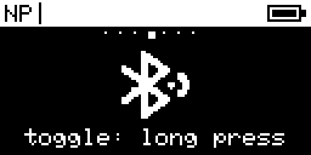<br><strong>Bluetooth</strong></td>
  </tr>
  <tr>
    <td align="center">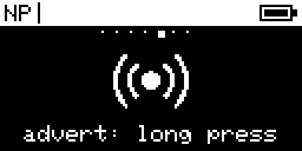<br><strong>Advert</strong></td>
    <td align="center"><br><strong>Power</strong></td>
  </tr>
</table>

Capture provenance and checksums are recorded with each device gallery under [`docs/images`](docs/images).

## Current builds

Each product release is pinned to an exact source commit and artifact checksum in [`catalog.json`](catalog.json). Board-specific bootloaders, partitions, displays, and radio power paths remain separate.

| Hardware | Role | Current release | Normal install |
|---|---|---|---|
| Heltec WiFi LoRa 32 V3 + OLED | BLE or native-USB companion with NeonPocket UI | [v1.0.0-rc.3](https://github.com/n30nex/NeonPocketMC-Heltec-V3/releases/tag/v1.0.0-rc.3) | Flash the selected app `.bin` at `0x10000` |
| Heltec WiFi LoRa 32 V4 + OLED | BLE or native-USB companion with NeonPocket UI | [v1.0.0-rc.3](https://github.com/n30nex/NeonPocketMC-Heltec-V4/releases/tag/v1.0.0-rc.3) | Flash the selected app `.bin` at `0x10000` |
| RC52-L62 + NV3001B TFT | BLE or native-USB companion with NeonPocket UI | [v1.1.0-rc.4](https://github.com/n30nex/NeonPocketMC-RC52/releases/tag/v1.1.0-rc.4) | Copy the selected `.uf2` to the RC52 bootloader drive |
| RC52-L62 | Headless low-power repeater | [v1.1.0-rc.2](https://github.com/n30nex/NeonPocketMC-RC52-Repeater/releases/tag/v1.1.0-rc.2) | Copy the repeater `.uf2` to the RC52 bootloader drive |
| RC52-L62 | Headless Room Server | [v1.1.0-rc.2](https://github.com/n30nex/NeonPocketMC-RC52-Repeater/releases/tag/v1.1.0-rc.2) | Copy the headless Room Server `.uf2` |
| RC52-L62 + NV3001B TFT | Room Server with local dashboard | [v1.1.0-rc.2](https://github.com/n30nex/NeonPocketMC-RC52-Repeater/releases/tag/v1.1.0-rc.2) | Copy the TFT Room Server `.uf2` |
| RCC6 + NV3001B TFT | Ultimate BLE, native-USB, or Wi-Fi Web companion | [v2.3.0-rc.3](https://github.com/n30nex/NeonPocketMC-RCC6/releases/tag/v2.3.0-rc.3) | Flash the selected app `.bin` at `0x10000` |
| RCC6 | Ultimate MQTT observer/repeater with setup WebUI | [v1.3.0-rc.1](https://github.com/n30nex/NeonPocketMC-RCC6-Repeater/releases/tag/v1.3.0-rc.1) | Flash the observer app at `0x10000`, then run the configurator |
| RCC6, TFT optional | Ultimate minimal or full Room Server | [v1.3.0-rc.1](https://github.com/n30nex/NeonPocketMC-RCC6-Repeater/releases/tag/v1.3.0-rc.1) | Pick minimal/full and headless/TFT, then flash its app at `0x10000` |
| SenseCAP Indicator D1L | DeskOS touch companion with repeater and room management | [v1.7.6](https://github.com/n30nex/DeskOS-MeshCore/releases/tag/v1.7.6) | Existing DeskOS: app at `0x20000`; fresh install: full 8 MB image at `0x0` |

The RCC6 Web companion and networked service builds now use human-first dashboards with traffic bars, delivery and signal analytics, nearby-radio freshness, and coordinate-backed maps that never invent node locations. The MQTT observer/repeater defaults to **3-byte packet hash mode**. Its Windows/Linux configurator covers node name, radio preset and custom radio values, Wi-Fi, MQTT broker selection, and post-setup IP discovery. The preferred public brokers are `mqtt1.meshcore.ca` and `mqtt2.meshcore.ca`; the other upstream-compatible brokers remain selectable/configurable.

## Download the suite

Use the newest [NeonPocketMC suite release](https://github.com/n30nex/NeonPocketMC/releases) as the index. It carries the machine-readable catalog and checksum for the catalog; the product repositories above remain the single owners of their firmware binaries and setup packages.

Exact install filenames, sizes, SHA-256 values, release links, and source commits for every installable file are recorded in [`catalog.json`](catalog.json).

## Source layout

The seven firmware histories intentionally remain separate because they target different chips, bootloaders, transports, displays, and deployment roles. This repository indexes them as pinned Git submodules:

```text
firmware/
  heltec-v3-companion/
  heltec-v4-companion/
  rc52-companion/
  rc52-repeater/
  rcc6-companion/
  rcc6-mqtt-repeater/
  deskos-meshcore/
```

Clone the exact suite source with:

```bash
git clone --recurse-submodules https://github.com/n30nex/NeonPocketMC.git
```

If already cloned:

```bash
git submodule update --init --recursive
```

## Important hardware notes

- **RC52:** use the UF2 bootloader path for normal installs. Do not replace the SoftDevice or bootloader.
- **Heltec V3/V4:** use the matching app image at `0x10000` for normal updates. Do not erase the whole flash; full-chip backups can contain private MeshCore identity material.
- **RCC6:** use the app image at `0x10000` for normal updates. Use a merged recovery image at `0x0` only when bootloader/partition recovery is required. Do not erase the whole flash.
- **SenseCAP Indicator D1L:** use the DeskOS update image at `0x20000` on an existing install. The full 8 MB image at `0x0` is destructive and only for a fresh or unrecoverable device. The RP2040 SD bridge uses a separate UF2/BOOTSEL step; neither path formats the SD card.
- RCC6 merged recovery images stop well before SPIFFS and preserve MeshCore identity, contacts, channels, and preferences; they reset NVS-backed BLE bonds and saved Wi-Fi.
- The RC52 and RCC6 boards do **not** contain an MPPT controller suitable for an unregulated solar panel. Outdoor solar installs need an external regulator/charger matched to the panel and protected 1-cell battery.
- These are community prereleases, not official Heltec or MeshCore firmware.

See [`FLASHING.md`](FLASHING.md) for practical install and recovery instructions.

Room Server profiles, animated companion startup, RCC6 Diagnostics, and one-button Quick Reply are now shipped as prerelease candidates. Remaining improvements are tracked in [`docs/STACK_ROADMAP.md`](docs/STACK_ROADMAP.md).

## Verification

[`scripts/verify_catalog.py`](scripts/verify_catalog.py) confirms each Git submodule pin, release URL, digest, and catalog invariant. Product repositories retain their own exact-target build workflows and hardware-specific release evidence.

Root documentation and catalog code are MIT licensed. Each of the seven firmware submodules retains its own upstream and third-party licenses.
