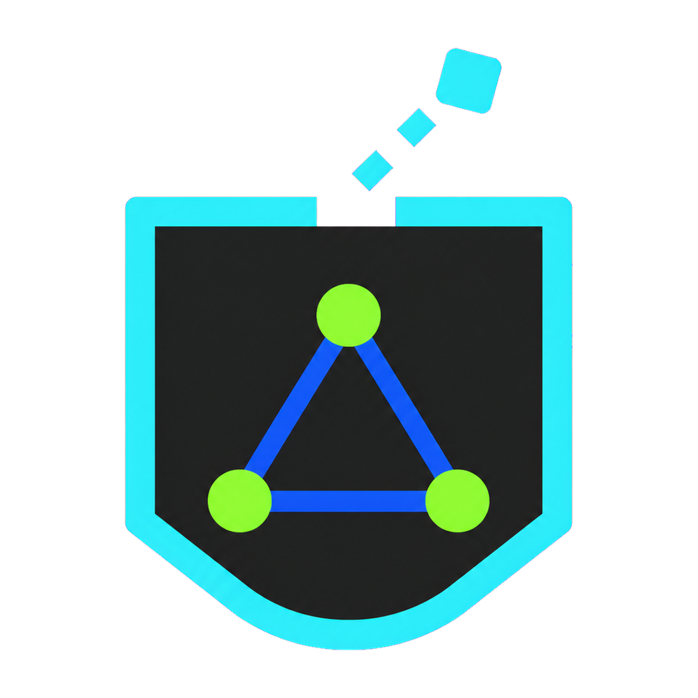

<p align="center">
  
</p>

<h1 align="center">NeonPocketMC</h1>

<p align="center"><strong>One bright interface for pocket-sized MeshCore radios.</strong></p>

One release catalog for the NeonPocketMC firmware family. This repository pins the exact released source for every supported RadioCore build and links to each product-owned download.

> **Choose by exact hardware and role. There is no universal image. Never flash an RC52 image to RCC6, or an RCC6 image to RC52.** Attach a suitable LoRa antenna before transmitting.

## Current builds

| Hardware | Role | Current release | Normal install |
|---|---|---|---|
| RC52-L62 + NV3001B TFT | BLE companion with NeonPocket UI | [v1.1.0-rc.1](https://github.com/n30nex/NeonPocketMC-RC52/releases/tag/v1.1.0-rc.1) | Copy the companion `.uf2` to the RC52 bootloader drive |
| RC52-L62 | Headless low-power repeater | [v1.1.0-rc.1](https://github.com/n30nex/NeonPocketMC-RC52-Repeater/releases/tag/v1.1.0-rc.1) | Copy the repeater `.uf2` to the RC52 bootloader drive |
| RC52-L62 | Headless Room Server | [v1.1.0-rc.1](https://github.com/n30nex/NeonPocketMC-RC52-Repeater/releases/tag/v1.1.0-rc.1) | Copy the headless Room Server `.uf2` |
| RC52-L62 + NV3001B TFT | Room Server with local dashboard | [v1.1.0-rc.1](https://github.com/n30nex/NeonPocketMC-RC52-Repeater/releases/tag/v1.1.0-rc.1) | Copy the TFT Room Server `.uf2` |
| RCC6 + NV3001B TFT | BLE companion or Wi-Fi Web/AP companion | [v1.2.0-rc.1](https://github.com/n30nex/NeonPocketMC-RCC6/releases/tag/v1.2.0-rc.1) | Flash the selected app `.bin` at `0x10000` |
| RCC6 | MQTT observer/repeater with setup WebUI | [v1.1.0-rc.1](https://github.com/n30nex/NeonPocketMC-RCC6-Repeater/releases/tag/v1.1.0-rc.1) | Flash the repeater app at `0x10000`, then run the configurator |
| RCC6, TFT optional | Minimal or full Room Server | [v1.1.0-rc.1](https://github.com/n30nex/NeonPocketMC-RCC6-Repeater/releases/tag/v1.1.0-rc.1) | Pick minimal/full and headless/TFT, then flash its app at `0x10000` |

The RCC6 MQTT observer/repeater defaults to **3-byte packet hash mode**. Its WebUI and Windows/Linux configurator cover node name, radio preset and custom radio values, Wi-Fi, MQTT broker selection, and post-setup IP discovery. The preferred public brokers are `mqtt1.meshcore.ca` and `mqtt2.meshcore.ca`; the other upstream-compatible brokers remain selectable/configurable.

## Download the suite

Use the newest [NeonPocketMC suite release](https://github.com/n30nex/NeonPocketMC/releases) as the index. It carries the machine-readable catalog and checksum for the catalog; the product repositories above remain the single owners of their firmware binaries and setup packages.

Exact install filenames, sizes, SHA-256 values, release links, and source commits for all 24 installable files are recorded in [`catalog.json`](catalog.json).

## Source layout

The four firmware histories intentionally remain separate because they target different chips, bootloaders, transports, and deployment roles. This repository indexes them as pinned Git submodules:

```text
firmware/
  rc52-companion/
  rc52-repeater/
  rcc6-companion/
  rcc6-mqtt-repeater/
```

Clone the exact suite source with:

```bash
git clone --recurse-submodules https://github.com/n30nex/NeonPocketMC.git
```

If already cloned:

```bash
git submodule update --init --recursive
```

## Important hardware notes

- **RC52:** use the UF2 bootloader path for normal installs. Do not replace the SoftDevice or bootloader.
- **RCC6:** use the app image at `0x10000` for normal updates. Use a merged recovery image at `0x0` only when bootloader/partition recovery is required. Do not erase the whole flash.
- RCC6 merged recovery images stop well before SPIFFS and preserve MeshCore identity, contacts, channels, and preferences; they reset NVS-backed BLE bonds and saved Wi-Fi.
- The RC52 and RCC6 boards do **not** contain an MPPT controller suitable for an unregulated solar panel. Outdoor solar installs need an external regulator/charger matched to the panel and protected 1-cell battery.
- These are community prereleases, not official Heltec or MeshCore firmware.

See [`FLASHING.md`](FLASHING.md) for practical install and recovery instructions.

Room Server profiles, animated companion startup, RCC6 Diagnostics, and one-button Quick Reply are now shipped as prerelease candidates. Remaining improvements are tracked in [`docs/STACK_ROADMAP.md`](docs/STACK_ROADMAP.md).

## Verification

[`scripts/verify_catalog.py`](scripts/verify_catalog.py) confirms each Git submodule pin, release URL, digest, and catalog invariant. Product repositories retain their own exact-target build workflows and hardware-specific release evidence.

Root documentation and catalog code are MIT licensed. Each firmware submodule retains its own upstream and third-party licenses.
